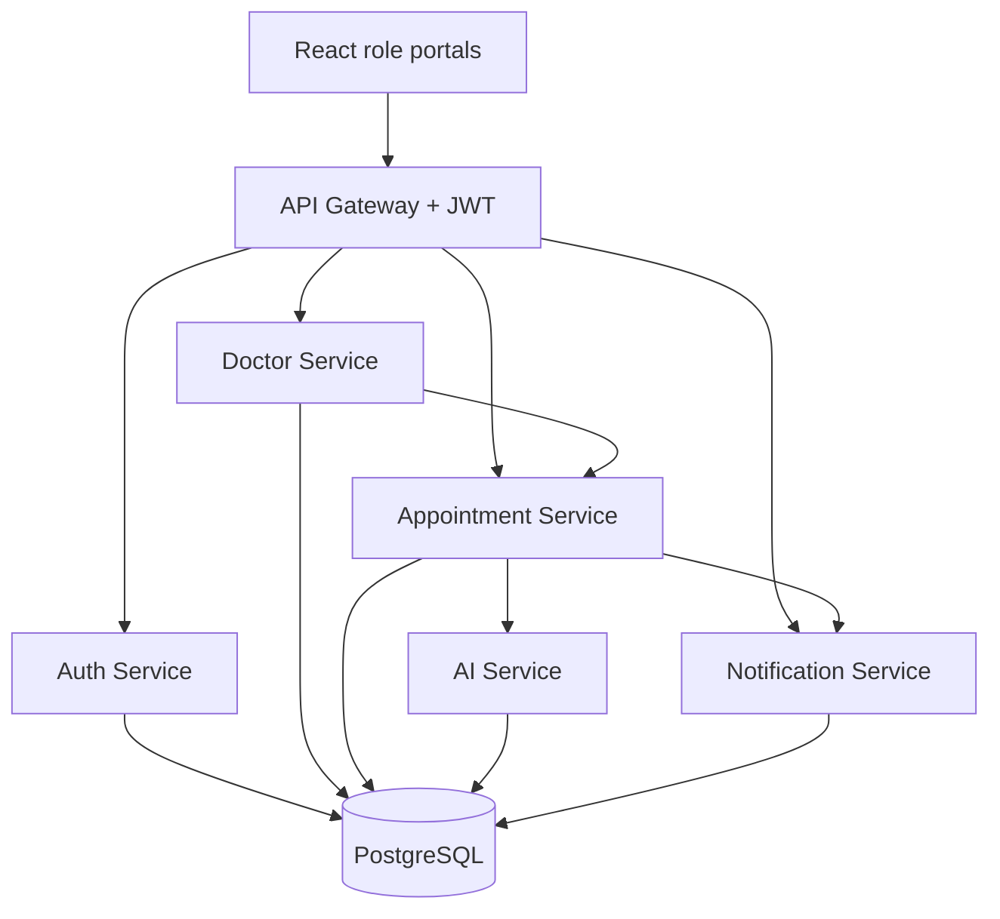
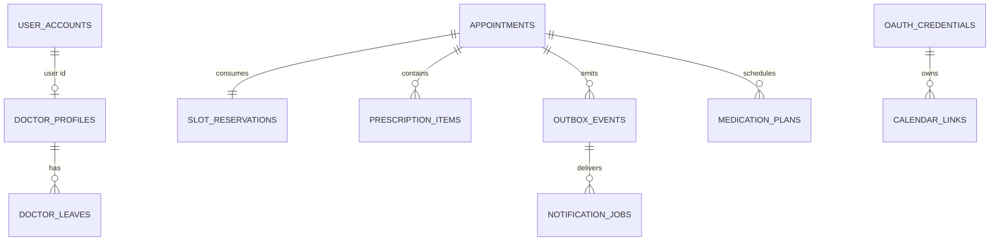

# CareFlow - Healthcare Appointment & Follow-up Manager

CareFlow is a complete full-stack implementation of the supplied assessment brief. It provides separate patient, doctor, and administrator experiences with live slot holds, concurrency-safe appointment confirmation, doctor-leave conflict handling, AI-assisted visit summaries, prescriptions, medication reminders, email delivery, and Google Calendar OAuth 2.0.

## Technology

- Frontend: React 18, TypeScript, Vite, responsive CSS
- Backend: Java 17, Spring Boot microservices, Spring Cloud Gateway, JPA, Flyway
- Data: PostgreSQL 16, database-per-service
- Security: BCrypt password hashing, signed JWT, role checks, gateway-supplied identity headers
- AI: Gemini REST API with secondary-model, cache, rule-based, and service-local fallbacks
- Integrations: SMTP email and Google Calendar REST API with OAuth 2.0
- Operations: Docker Compose, health endpoints, transactional outbox, retry workers

## Architecture



The gateway is the only public backend port. Internal services use `INTERNAL_API_KEY`, and their ports are not exposed by Docker Compose.

## Run with Docker (recommended)

Prerequisites: Docker Desktop with Compose v2.

Windows users can use the automatic [PowerShell setup and verification guide](docs/WINDOWS_POWERSHELL.md). It creates `.env`, generates secrets, builds the containers, waits for health, and prints the URLs.

```bash
cp .env.example .env
# Set JWT_SECRET and INTERNAL_API_KEY to two different random values.
# Add GEMINI_API_KEY, SMTP, and Google values when those integrations are required.
docker compose up --build
```

Open:

- Web application: `http://localhost:5173`
- API gateway: `http://localhost:8080`
- Gateway health: `http://localhost:8080/actuator/health`

Development admin credentials default to `admin@clinic.local` / `ChangeMe123!`. Change `ADMIN_PASSWORD` before any shared or production deployment.

On the first database startup, `infra/postgres/init.sql` creates `auth_db`, `doctor_db`, `appointment_db`, `ai_db`, and `notification_db`. If a previously created PostgreSQL volume exists without these databases, run `docker compose down -v` only if it is safe to delete that local development data, then start again.

## Local development without Docker

1. Install Java 17+, Maven 3.9+, Node 20+, and PostgreSQL 16+.
2. Create the five databases listed above and a PostgreSQL user matching `.env`.
3. Export environment variables from `.env.example`, replacing service hostnames with `localhost`.
4. Start each backend service in a separate terminal:

```bash
mvn -pl auth-service spring-boot:run
mvn -pl doctor-service spring-boot:run
mvn -pl ai-service spring-boot:run
mvn -pl notification-service spring-boot:run
mvn -pl appointment-service spring-boot:run
mvn -pl api-gateway spring-boot:run
```

5. Start the frontend:

```bash
cd frontend
npm install
npm run dev
```

## Configuration

All secrets are read from environment variables; none are committed. See [.env.example](.env.example) for the complete list.

| Variable | Purpose | Required |
|---|---|---|
| `JWT_SECRET` | Signs and verifies access tokens; use 32+ random characters | Yes |
| `INTERNAL_API_KEY` | Authenticates service-to-service calls | Yes |
| `GEMINI_API_KEY` | Enables primary Gemini summaries | No - fallbacks remain functional |
| `SMTP_*`, `SMTP_ENABLED` | Sends real email | No - dry-run is the development default |
| `GOOGLE_CLIENT_ID/SECRET` | Enables Calendar OAuth | Only for Calendar sync |
| `GOOGLE_REDIRECT_URI` | OAuth callback registered in Google Cloud | Only for Calendar sync |

## Main user flows

### Patient

Register, search by specialisation, select an open time, obtain a five-minute database hold, describe symptoms, confirm the booking, view AI-supported summaries, and cancel future appointments.

### Doctor

Review assigned appointments and pre-visit urgency summaries, submit clinical notes and structured prescription data, and generate a plain-language post-visit plan. Medication reminder schedules are created from the exact clinician-entered frequency and duration.

### Administrator

Create a doctor login plus profile, define working hours and slot duration, and mark leave. Leave creation calls the appointment service transactionally; affected appointments are cancelled, reservations are released, and notification/calendar deletion events are placed in the outbox.

## API summary

All non-public endpoints require `Authorization: Bearer <JWT>` through the gateway.

| Method | Endpoint | Role | Purpose |
|---|---|---|---|
| POST | `/api/auth/register` | Public | Register patient |
| POST | `/api/auth/login` | Public | Log in and receive JWT |
| POST | `/api/auth/admin/users` | Admin | Create doctor/admin login |
| GET | `/api/doctors?specialisation=` | Authenticated | Search active doctors |
| POST | `/api/admin/doctors` | Admin | Create doctor profile |
| PUT | `/api/admin/doctors/{id}` | Admin | Update schedule/profile |
| POST | `/api/admin/doctors/{id}/leaves` | Admin | Add leave and resolve conflicts |
| POST | `/api/appointments/holds` | Patient | Hold slot for five minutes |
| POST | `/api/appointments` | Patient | Confirm held slot and summarize symptoms |
| GET | `/api/appointments` | Any role | Role-scoped appointment list |
| PUT | `/api/appointments/{id}/reschedule` | Patient/Admin | Consume new hold and move appointment |
| DELETE | `/api/appointments/{id}` | Owner/Admin | Cancel and release slot |
| POST | `/api/appointments/{id}/post-visit` | Assigned doctor | Save notes/prescription and create summary |
| GET | `/api/calendar/oauth/url` | Authenticated | Begin Calendar connection |
| GET | `/api/calendar/status` | Authenticated | Check Calendar connection |

Full request/response examples are in [docs/API.md](docs/API.md).

## Database schema

Each service owns its schema. Flyway migrations are under each service's `src/main/resources/db/migration` directory. The critical concurrency constraint is `UNIQUE (doctor_id, start_at)` on `slot_reservations`; cancelled appointments delete their reservation, making the slot bookable again.



See [docs/DB_SCHEMA.md](docs/DB_SCHEMA.md) for table-level details.

## AI prompts and fallback behavior

AI output is never required for appointment integrity. The AI service validates structured JSON and stores successful outputs in `ai_summary_cache`.

1. Gemini primary model (`GEMINI_PRIMARY_MODEL`)
2. Gemini secondary model (`GEMINI_FALLBACK_MODEL`)
3. Exact-input cached summary
4. Deterministic red-flag/template summarizer
5. Appointment-service local safety summary if the entire AI service is unreachable

Calls have connect/response timeouts, controlled retries, backoff, and a short circuit-breaker cooldown. Every output includes its generation source and a clinician-review notice. Exact prompts and safety constraints are documented in [docs/LLM_PROMPTS.md](docs/LLM_PROMPTS.md).

## Email and Calendar reliability

Appointment transactions write an outbox event in the same database transaction as the booking/change. A worker sends it to the notification service with idempotency keys and exponential retry. The notification service persists independent email and Calendar jobs, retries temporary failures, and records terminal failures for operations review. Development uses `NOTIFICATION_DRY_RUN=true`; set SMTP values and `SMTP_ENABLED=true` for real mail.

Google Calendar connection instructions are in [docs/GOOGLE_CALENDAR_SETUP.md](docs/GOOGLE_CALENDAR_SETUP.md).

## Testing

```bash
mvn test
cd frontend && npm install && npm run build
```

Unit tests cover the deterministic emergency fallback and atomic slot-conflict path. For the database concurrency test described in [docs/TESTING.md](docs/TESTING.md), run PostgreSQL and issue parallel hold requests for the same doctor/time; exactly one must return `201`, and the rest must return `409`.

## Deployment

The repository is deployment-ready but cannot create a hosted URL without credentials for the chosen hosting account. Follow [docs/DEPLOYMENT.md](docs/DEPLOYMENT.md) to deploy the frontend to Vercel and the gateway/services/PostgreSQL to Railway or Render. Use HTTPS URLs for the frontend, gateway, and Google callback in production.

## Additional deliverables

- [System design write-up](docs/SYSTEM_DESIGN.md) (under 800 words)
- [System design PDF](docs/Healthcare_Appointment_Manager_System_Design.pdf)
- [API documentation](docs/API.md)
- [Database schema](docs/DB_SCHEMA.md)
- [LLM prompts](docs/LLM_PROMPTS.md)
- [Google Calendar setup](docs/GOOGLE_CALENDAR_SETUP.md)
- [Deployment guide](docs/DEPLOYMENT.md)
- [Testing guide](docs/TESTING.md)
- [Windows PowerShell run guide](docs/WINDOWS_POWERSHELL.md)
- [Verification report](VERIFICATION.md)

## Medical safety note

This project is an assessment implementation, not a certified medical device. It deliberately avoids diagnosis, preserves clinician-entered medication text, shows emergency guidance, and requires clinical review of generated summaries. Production use additionally requires privacy, security, consent, audit, retention, accessibility, and applicable healthcare-regulation review.
